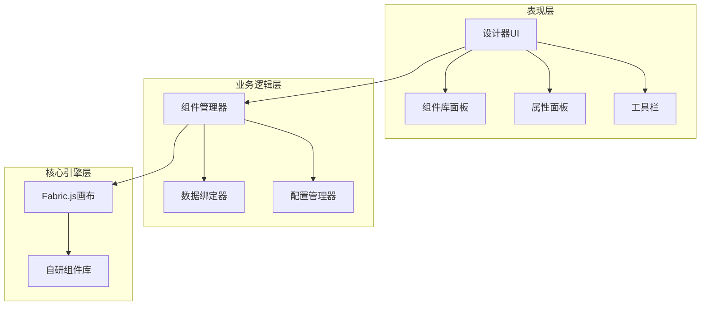
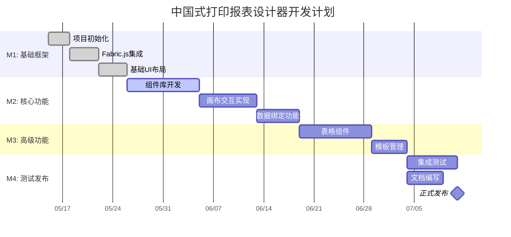

# 中国式打印报表设计器产品需求文档

---

## 目录

- [1. 执行摘要](#1-执行摘要)
- [2. 产品背景与目标](#2-产品背景与目标)
- [3. 用户画像与故事](#3-用户画像与故事)
- [4. 功能需求](#4-功能需求)
- [5. 非功能需求](#5-非功能需求)
- [6. 技术规格](#6-技术规格)
- [7. UI/UX 设计](#7-uiux-设计)
  - [7.1 设计原则](#71-设计原则)
  - [7.2 界面布局](#72-界面布局)
- [8. 风险分析](#8-风险分析)
- [9. 项目规划](#9-项目规划)
- [10. 附录](#10-附录)

---

## 1. 执行摘要

### 1.1 产品概述

| 项目 | 内容 |
|------|------|
| 产品名称 | 中国式打印报表设计器 |
| 版本号 | v1.0.0 |
| 目标发布日期 | 2026-08-01 |
| 产品负责人 | 产品团队 |
| 文档状态 | 已批准 |

### 1.2 一句话描述

> 面向企业 ERP/WMS/CRM 系统的可视化报表设计工具，支持拖拽式设计中国式复杂报表（多表头、合并单元格、条码二维码），输出标准 JSON 配置，让业务人员无需编码即可自主设计打印模板。

---

## 2. 产品背景与目标

### 2.1 市场背景

- **数字化转型加速**: 国内企业 ERP/WMS/CRM 系统普及，报表需求爆发式增长
- **低代码/无代码兴起**: 业务人员期望自主配置，减少 IT 依赖
- **中国式报表特色**: 复杂表头、合并单元格、斜线表头等需求独特，国外工具支持不佳

### 2.2 用户痛点

1. 开发人员硬编码报表，维护成本高
2. 业务人员无法自主修改报表格式
3. 缺乏专门针对中国式报表的轻量工具
4. 现有工具组件库不支持条码、二维码

---

## 3. 用户画像与故事

### 3.1 目标用户画像

| 属性 | 描述 |
|------|------|
| 主要用户 | 前端开发工程师、ERP 实施顾问 |
| 年龄 | 25-35 岁 |
| 技术能力 | 熟悉 Vue/React，了解 Canvas |
| 核心需求 | 快速生成报表 JSON 配置，减少硬编码工作 |

---

## 4. 功能需求

### 4.1 核心功能模块

| 功能 ID | 功能名称 | 描述 | 优先级 |
|---------|----------|------|--------|
| F-001 | 画布设置 | 设置报表尺寸（A4/A5/自定义） | P0 |
| F-002 | 区域划分 | 自动划分页眉区、明细区、页脚区 | P0 |
| F-003 | 网格对齐 | 显示网格线，支持吸附对齐 | P0 |
| F-005 | 拖拽组件 | 从组件库拖拽组件到画布 | P0 |

### 4.2 自研组件库

- **标签组件** - 文本显示，支持数据绑定和模板
- **条码组件** - 支持 CODE128/CODE39/EAN13 等格式
- **二维码组件** - 支持 URL/文本内容，可配置容错等级
- **表格组件** - 支持多表头、单元格合并、自动循环渲染

---

## 5. 非功能需求

### 5.1 性能需求

| 指标 | 要求 | 测量条件 |
|------|------|----------|
| 页面首次加载时间 | < 1.5 秒 | 首次访问 |
| 组件拖拽响应 | 流畅，无明显延迟 | 同时拖拽 50 个组件 |
| JSON 导出时间 | < 1 秒 | 100 个组件 |
| 表格数据承载 | 1000 行明细数据 | 不卡顿 |

---

## 6. 技术规格

### 6.1 系统架构



### 6.2 技术栈

| 层级 | 技术选型 | 版本 |
|------|----------|------|
| 构建工具 | Vite | 5+ |
| 前端框架 | Vue | 3.5+ |
| 开发语言 | TypeScript | 5+ |
| 状态管理 | Pinia | 2+ |
| 画布引擎 | Fabric.js | 6+ |
| UI 组件库 | Element Plus | 2+ |

---

## 7. UI/UX 设计

### 7.1 设计原则

1. **简洁高效** - 界面布局清晰，减少认知负担
2. **所见即所得** - 设计效果与打印效果一致
3. **操作直观** - 拖拽自然，属性配置即时反馈
4. **区域分明** - 清晰区分页眉/明细/页脚三大区域

### 7.2 界面布局

#### 设计器整体布局

```
┌────────────────────────────────────────────────────────────────────────────────────┐
│ 🔧 工具栏                                                                          │
│ [🆕新建][📂打开][💾保存][↩️撤销][↪️重做][👁️预览][📤导出JSON][🖨️打印]           │
├─────────────┬──────────────────────────────────────────────────┬───────────────────┤
│             │                                                  │                   │
│  📦 组件库   │              🎨 画布设计区 (A4纸张)               │    ⚡ 属性面板     │
│             │                                                  │                   │
│ ┌─────────┐ │  ┌────────────────────────────────────────────┐  │  ┌─────────────┐  │
│ │ 🏷️ 文本  │ │  │                                            │  │  │  📐 组件属性   │  │
│ │ 📊 条码  │ │  │           销 售 出 库 单                    │  │  ├─────────────┤  │
│ │ 🔲 二维码│ │  │                                            │  │  │ X: 100       │  │
│ │ 📋 表格  │ │  │  客户名称：某某科技有限公司                  │  │  │ Y: 50        │  │
│ │ 📐 矩形  │ │  │  出库日期：2026-05-09   单据编号：CK2024001 │  │  │ W: 200       │  │
│ │ 🖼️ 图片  │ │  │  联系人：张三           联系电话：13800138000│  │  │ H: 30        │  │
│ └─────────┘ │  │                                            │  │  │              │  │
│             │  │  ┌────────┬────┬────┬────┬──────┬──────┬──┐  │  │  🔗 数据绑定   │  │
│             │  │  │产品名称│规格│单位│数量│ 单价 │ 金额 │备│  │  ├─────────────┤  │
│             │  │  ├────────┼────┼────┼────┼──────┼──────┼──┤  │  │ 数据源:      │  │
│             │  │  │ 商品A  │ 个 │ 件 │ 10 │100.00│1000.0│  │  │  │ headerData   │  │
│             │  │  │ 商品B  │ 箱 │ 件 │  5 │200.00│1000.0│  │  │  │              │  │
│             │  │  │ 商品C  │ 包 │ 件 │  2 │500.00│1000.0│  │  │  绑定字段:     │  │
│             │  │  └────────┴────┴────┴────┴──────┴──────┴──┘  │  │ customerName │  │
│             │  │                                            │  │              │  │
│             │  │  合计金额：¥3000.00   (叁仟元整)            │  │  🎨 样式设置   │  │
│             │  │                                            │  │  ├─────────────┤  │
│             │  │  制单人：_________  审核人：_________       │  │  │ 字体: 黑体   │  │
│             │  │  仓管员：_________  送货人：_________       │  │  │ 字号: 14px   │  │
│             │  │                                            │  │  │ 颜色: #000   │  │
│             │  │           📊 [条码]   🔲 [二维码]           │  │  └─────────────┘  │
│             │  │                                            │  │                   │
│             │  └────────────────────────────────────────────┘  │                   │
│             │                                                  │                   │
├─────────────┴──────────────────────────────────────────────────┴───────────────────┤
│ 📊 状态栏: ✅ 就绪  |  组件数: 18  |  💾 已保存  |  🕐 14:35:20                    │
└────────────────────────────────────────────────────────────────────────────────────┘
```

#### 布局说明

| 区域 | 位置 | 尺寸 | 功能说明 |
|------|------|------|----------|
| **顶部工具栏** | 最顶部 | 高 48px，宽 100% | 文件操作、撤销重做、预览、导出、打印 |
| **左侧组件库** | 左侧 | 宽 200px | 可拖拽组件：标签、条码、二维码、表格、矩形、图片 |
| **中间画布区** | 中央 | 自适应剩余空间 | A4纸张设计区，包含页眉/明细/页脚三区 |
| **右侧属性面板** | 右侧 | 宽 280px | 组件属性、数据绑定、样式设置三标签页 |
| **底部状态栏** | 最底部 | 高 28px，宽 100% | 就绪状态、组件数量、保存状态、当前时间 |

#### 画布区域详细说明

画布中央显示 **A4 纸张**（210×297mm），内部划分为三个区域：

| 区域 | 用途 | 典型内容示例 |
|------|------|-------------|
| **页眉区** | 单据头部信息 | 标题"销售出库单"、客户名称、日期、单据编号、联系人、电话 |
| **明细区** | 数据表格 | 产品明细表格（名称、规格、单位、数量、单价、金额、备注），支持循环渲染 |
| **页脚区** | 合计和签字 | 金额合计、大写金额、制单人/审核人/仓管员/送货人签字栏、条码、二维码 |

---

## 8. 风险分析

### 8.1 技术风险

| 风险 | 可能性 | 影响 | 缓解措施 |
|------|--------|------|----------|
| Fabric.js 与 Vue 3.5 集成问题 | 中 | 高 | 技术预研和 POC 验证 |
| 表格组件多表头+合并实现复杂 | 高 | 高 | 分阶段实现，先基础表格 |
| 浏览器打印兼容性问题 | 中 | 高 | 充分测试主流浏览器 |

---

## 9. 项目规划

### 9.1 里程碑



### 9.2 资源需求

| 角色 | 人数 | 职责 |
|------|------|------|
| 产品经理 | 1 | 需求定义、项目管理 |
| 前端技术负责人 | 1 | 架构设计、技术决策 |
| 高级前端开发 | 2 | 核心功能开发 |
| QA 工程师 | 1 | 测试质量保证 |

---

## 10. 附录

### 10.1 术语表

| 术语 | 解释 |
|------|------|
| headerData | 页眉区域数据，包含单据头部信息 |
| Datas | 明细区域数据，数组格式，支持循环渲染 |
| footerData | 页脚区域数据，包含合计和备注信息 |
| Fabric.js | 强大的 Canvas 交互库 |
| 数据绑定 | 将报表组件与数据字段关联 |

### 10.2 参考资料

- Vue 3.5 官方文档: https://vuejs.org/
- Fabric.js 官方文档: http://fabricjs.com/
- Pinia 官方文档: https://pinia.vuejs.org/

---

*本文档使用 PRD Generator Skill 生成 | 最后更新: 2026-05-09*
