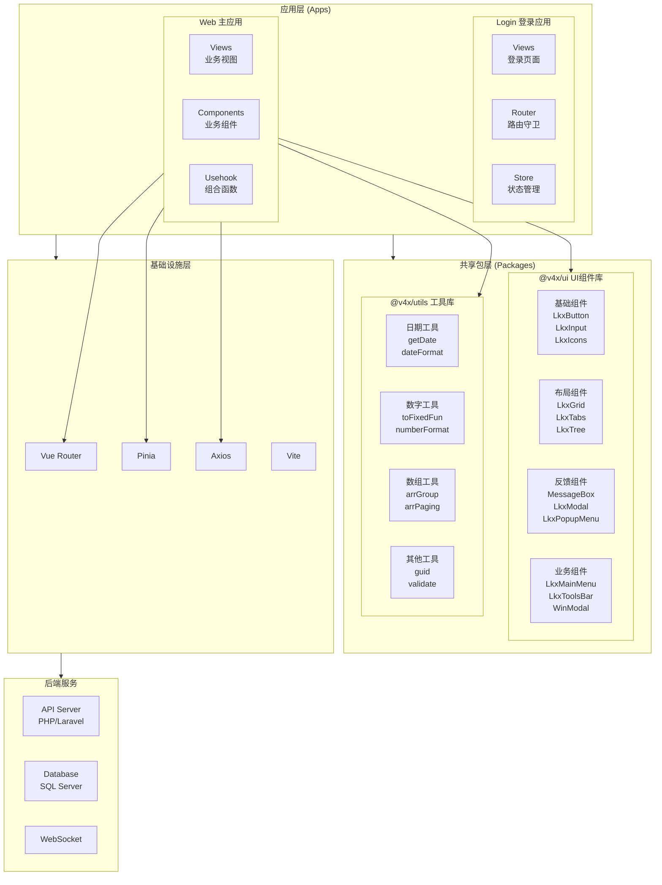
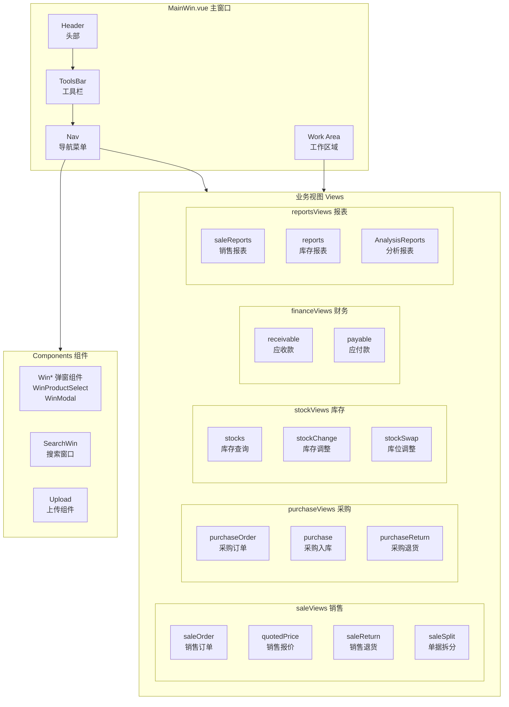
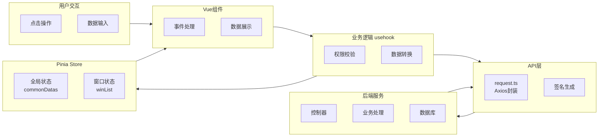
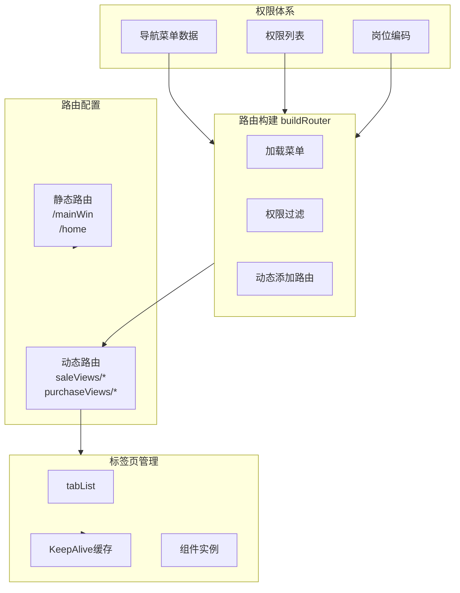
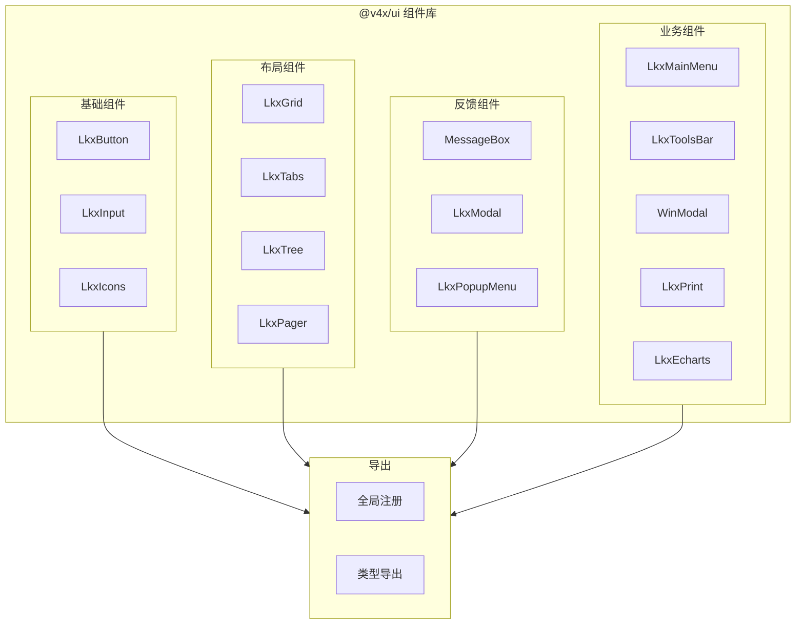
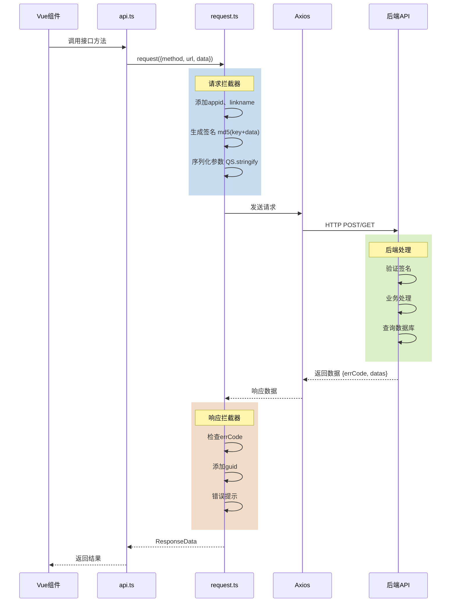
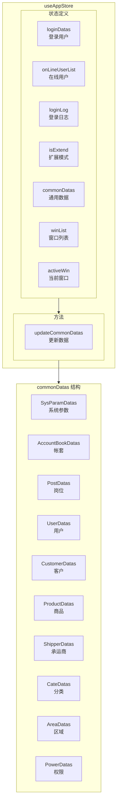
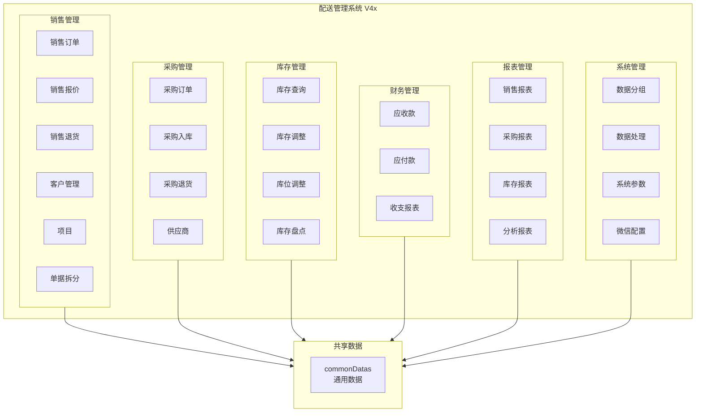

# 配送管理系统 V4x - 架构图

## 1. 系统整体架构图

```mermaid
graph TB
    subgraph Apps["应用层 (Apps)"]
        subgraph Login["Login 登录应用"]
            L_Views["Views<br/>登录页面"]
            L_Router["Router<br/>路由守卫"]
            L_Store["Store<br/>状态管理"]
        end
        
        subgraph Web["Web 主应用"]
            W_Views["Views<br/>业务视图"]
            W_Components["Components<br/>业务组件"]
            W_Usehook["Usehook<br/>组合函数"]
        end
    end
    
    subgraph Packages["共享包层 (Packages)"]
        subgraph UI["@v4x/ui UI组件库"]
            UI_Basic["基础组件<br/>LkxButton<br/>LkxInput<br/>LkxIcons"]
            UI_Layout["布局组件<br/>LkxGrid<br/>LkxTabs<br/>LkxTree"]
            UI_Feedback["反馈组件<br/>MessageBox<br/>LkxModal<br/>LkxPopupMenu"]
            UI_Business["业务组件<br/>LkxMainMenu<br/>LkxToolsBar<br/>WinModal"]
        end
        
        subgraph Utils["@v4x/utils 工具库"]
            U_Date["日期工具<br/>getDate<br/>dateFormat"]
            U_Number["数字工具<br/>toFixedFun<br/>numberFormat"]
            U_Array["数组工具<br/>arrGroup<br/>arrPaging"]
            U_Other["其他工具<br/>guid<br/>validate"]
        end
    end
    
    subgraph Infrastructure["基础设施层"]
        Router["Vue Router"]
        Store["Pinia"]
        HTTP["Axios"]
        Vite["Vite"]
    end
    
    subgraph Backend["后端服务"]
        API["API Server<br/>PHP/Laravel"]
        DB["Database<br/>SQL Server"]
        WS["WebSocket"]
    end
    
    Apps --> Packages
    Apps --> Infrastructure
    Infrastructure --> Backend
    
    Web --> Router
    Web --> Store
    Web --> HTTP
    Web --> UI
    Web --> Utils
```

## 2. Web应用模块架构

```mermaid
graph TB
    subgraph MainWin["MainWin.vue 主窗口"]
        Header["Header<br/>头部"]
        ToolsBar["ToolsBar<br/>工具栏"]
        Nav["Nav<br/>导航菜单"]
        Work["Work Area<br/>工作区域"]
    end
    
    subgraph Views["业务视图 Views"]
        subgraph Sale["saleViews 销售"]
            S_Order["saleOrder<br/>销售订单"]
            S_Quote["quotedPrice<br/>销售报价"]
            S_Return["saleReturn<br/>销售退货"]
            S_Split["saleSplit<br/>单据拆分"]
        end
        
        subgraph Purchase["purchaseViews 采购"]
            P_Order["purchaseOrder<br/>采购订单"]
            P_In["purchase<br/>采购入库"]
            P_Out["purchaseReturn<br/>采购退货"]
        end
        
        subgraph Stock["stockViews 库存"]
            St_Query["stocks<br/>库存查询"]
            St_Change["stockChange<br/>库存调整"]
            St_Swap["stockSwap<br/>库位调整"]
        end
        
        subgraph Finance["financeViews 财务"]
            F_Recv["receivable<br/>应收款"]
            F_Pay["payable<br/>应付款"]
        end
        
        subgraph Report["reportsViews 报表"]
            R_Sale["saleReports<br/>销售报表"]
            R_Stock["reports<br/>库存报表"]
            R_Analysis["AnalysisReports<br/>分析报表"]
        end
    end
    
    subgraph Components["Components 组件"]
        Win["Win* 弹窗组件<br/>WinProductSelect<br/>WinModal"]
        Search["SearchWin<br/>搜索窗口"]
        Upload["Upload<br/>上传组件"]
    end
    
    Header --> ToolsBar
    ToolsBar --> Nav
    Nav --> Views
    Nav --> Components
    Work --> Views
```

## 3. 数据流架构

```mermaid
flowchart LR
    subgraph User["用户交互"]
        Click["点击操作"]
        Input["数据输入"]
    end
    
    subgraph Component["Vue组件"]
        Event["事件处理"]
        Display["数据展示"]
    end
    
    subgraph Action["业务逻辑 usehook"]
        Auth["权限校验"]
        Transform["数据转换"]
    end
    
    subgraph Store["Pinia Store"]
        Global["全局状态<br/>commonDatas"]
        Window["窗口状态<br/>winList"]
    end
    
    subgraph API["API层"]
        Request["request.ts<br/>Axios封装"]
        Sign["签名生成"]
    end
    
    subgraph Server["后端服务"]
        Controller["控制器"]
        Service["业务处理"]
        DB["数据库"]
    end
    
    User --> Component
    Component --> Action
    Action --> Store
    Action --> API
    Store --> Component
    API --> Server
    Server --> API
```

## 4. 路由与权限架构

```mermaid
flowchart TB
    subgraph Router["路由配置"]
        Static["静态路由<br/>/mainWin<br/>/home"]
        Dynamic["动态路由<br/>saleViews/*<br/>purchaseViews/*"]
    end
    
    subgraph Auth["权限体系"]
        NavItems["导航菜单数据"]
        PowerList["权限列表"]
        PostCode["岗位编码"]
    end
    
    subgraph Build["路由构建 buildRouter"]
        Load["加载菜单"]
        Filter["权限过滤"]
        Add["动态添加路由"]
    end
    
    subgraph Tab["标签页管理"]
        TabList["tabList"]
        Cache["KeepAlive缓存"]
        Instance["组件实例"]
    end
    
    NavItems --> Build
    PowerList --> Build
    PostCode --> Build
    Static --> Router
    Build --> Dynamic
    Dynamic --> Tab
    Tab --> Cache
```

## 5. UI组件库架构

```mermaid
graph TB
    subgraph UI_Library["@v4x/ui 组件库"]
        subgraph Basic["基础组件"]
            B_Button["LkxButton"]
            B_Input["LkxInput"]
            B_Icon["LkxIcons"]
        end
        
        subgraph Layout["布局组件"]
            L_Grid["LkxGrid"]
            L_Tabs["LkxTabs"]
            L_Tree["LkxTree"]
            L_Pager["LkxPager"]
        end
        
        subgraph Feedback["反馈组件"]
            F_Message["MessageBox"]
            F_Modal["LkxModal"]
            F_Popup["LkxPopupMenu"]
        end
        
        subgraph Business["业务组件"]
            Bus_Menu["LkxMainMenu"]
            Bus_Tools["LkxToolsBar"]
            Bus_Win["WinModal"]
            Bus_Print["LkxPrint"]
            Bus_Chart["LkxEcharts"]
        end
    end
    
    subgraph Export["导出"]
        E_Components["全局注册"]
        E_Types["类型导出"]
    end
    
    Basic --> Export
    Layout --> Export
    Feedback --> Export
    Business --> Export
```

## 6. 请求与响应流程

```mermaid
sequenceDiagram
    participant View as Vue组件
    participant API as api.ts
    participant Req as request.ts
    participant Axios as Axios
    participant Server as 后端API
    
    View->>API: 调用接口方法
    API->>Req: request({method, url, data})
    
    rect rgb(200, 220, 240)
        Note over Req: 请求拦截器
        Req->>Req: 添加appid、linkname
        Req->>Req: 生成签名 md5(key+data)
        Req->>Req: 序列化参数 QS.stringify
    end
    
    Req->>Axios: 发送请求
    Axios->>Server: HTTP POST/GET
    
    rect rgb(220, 240, 200)
        Note over Server: 后端处理
        Server->>Server: 验证签名
        Server->>Server: 业务处理
        Server->>Server: 查询数据库
    end
    
    Server-->>Axios: 返回数据 {errCode, datas}
    Axios-->>Req: 响应数据
    
    rect rgb(240, 220, 200)
        Note over Req: 响应拦截器
        Req->>Req: 检查errCode
        Req->>Req: 添加guid
        Req->>Req: 错误提示
    end
    
    Req-->>API: ResponseData
    API-->>View: 返回结果
```

## 7. 状态管理架构

```mermaid
graph TB
    subgraph AppStore["useAppStore"]
        subgraph State["状态定义"]
            S_User["loginDatas<br/>登录用户"]
            S_Online["onLineUserList<br/>在线用户"]
            S_Log["loginLog<br/>登录日志"]
            S_Extend["isExtend<br/>扩展模式"]
            S_Common["commonDatas<br/>通用数据"]
            S_Win["winList<br/>窗口列表"]
            S_Active["activeWin<br/>当前窗口"]
        end
        
        subgraph Action["方法"]
            A_Update["updateCommonDatas<br/>更新数据"]
        end
    end
    
    subgraph CommonDatas["commonDatas 结构"]
        CD_System["SysParamDatas<br/>系统参数"]
        CD_Book["AccountBookDatas<br/>帐套"]
        CD_Post["PostDatas<br/>岗位"]
        CD_User["UserDatas<br/>用户"]
        CD_Customer["CustomerDatas<br/>客户"]
        CD_Product["ProductDatas<br/>商品"]
        CD_Shipper["ShipperDatas<br/>承运商"]
        CD_Cate["CateDatas<br/>分类"]
        CD_Area["AreaDatas<br/>区域"]
        CD_Power["PowerDatas<br/>权限"]
    end
    
    State --> Action
    Action --> CommonDatas
```

## 8. 业务模块划分

```mermaid
graph TB
    subgraph System["配送管理系统 V4x"]
        subgraph Sale["销售管理"]
            S1["销售订单"]
            S2["销售报价"]
            S3["销售退货"]
            S4["客户管理"]
            S5["项目"]
            S6["单据拆分"]
        end
        
        subgraph Purchase["采购管理"]
            P1["采购订单"]
            P2["采购入库"]
            P3["采购退货"]
            P4["供应商"]
        end
        
        subgraph Stock["库存管理"]
            K1["库存查询"]
            K2["库存调整"]
            K3["库位调整"]
            K4["库存盘点"]
        end
        
        subgraph Finance["财务管理"]
            F1["应收款"]
            F2["应付款"]
            F3["收支报表"]
        end
        
        subgraph Report["报表管理"]
            R1["销售报表"]
            R2["采购报表"]
            R3["库存报表"]
            R4["分析报表"]
        end
        
        subgraph SystemMG["系统管理"]
            SM1["数据分组"]
            SM2["数据处理"]
            SM3["系统参数"]
            SM4["微信配置"]
        end
    end
    
    Sale --> Common
    Purchase --> Common
    Stock --> Common
    Finance --> Common
    Report --> Common
    SystemMG --> Common
    
    subgraph Common["共享数据"]
        CD["commonDatas<br/>通用数据"]
    end
```

---

*图表结束*
